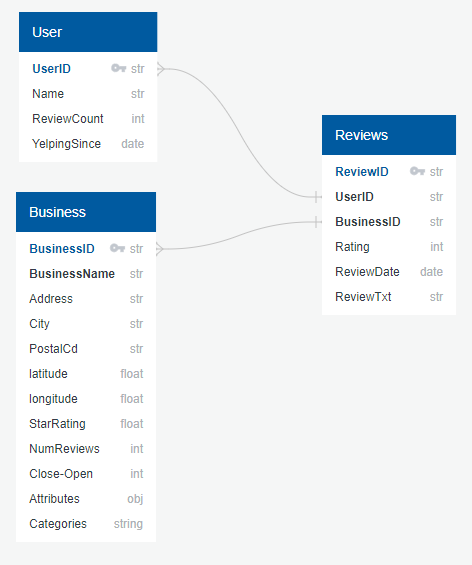
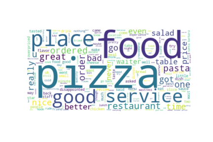
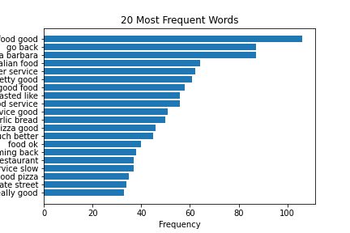
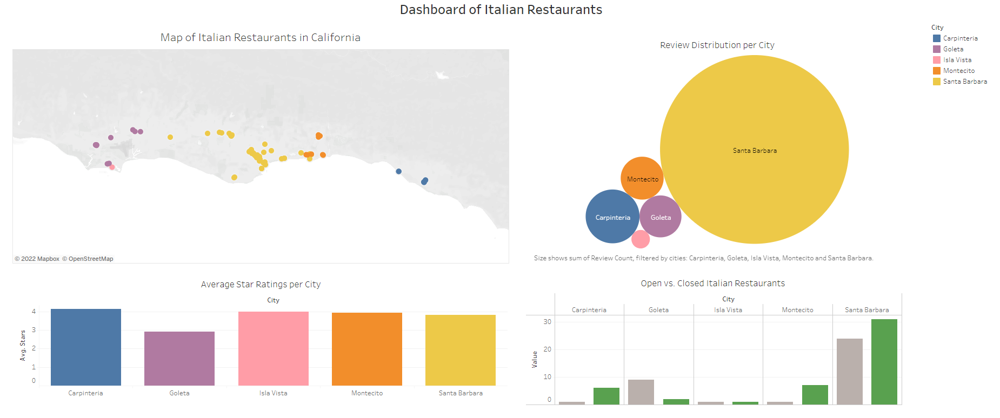

# Final Group Project 

The Data Analytics Bootcamp's final group project is a platform to exhibit your learned skills. The project has been specifically designed for this purpose. Every team member has been allocated a role to play for project completion. The final project is the culmination of the skills acquired in the Data Analytics Bootcamp.

The team members and their designated roles are listed below:

* Katrin Freitag: Circle
* Boakye Twum-Donkor: Square
* Matthew Lao: Triangle
* Anand Bajaj: X

## Topic

### Topic Selection
Our group has chosen to examine the significance of **customer reviews** for businesses. Our decision to focus on this topic is due to the fact that positive reviews can serve as a valuable form of word-of-mouth advertising for businesses. They can often be a determining factor in whether or not a customer chooses to visit a particular establishment. Moreover, from the perspective of business owners, analyzing commonly used words in reviews can help them improve their business model and expand their customer base. Such frequently used words can also be used for targeted advertising on social media platforms and search engines.

### Data Source
To assist in the analysis of customer reviews, we have opted to utilize the publicly accessible [Yelp Dataset](https://www.yelp.com/dataset/). This particular dataset offers a vast amount of data pertaining to businesses in both the United States and Canada. It includes data on users, business reviews, star ratings, and rating counts. An ERD model has been used to depict the connections between each dataset.

To facilitate the filtering of the required data for our analysis, each business has been classified into specific categories. The dataset has been methodically sorted, cleaned, and then exported into CSV files for further examination. Given the vast number of reviews available, we have opted to concentrate on a subset of data pertaining to **Italian restaurants in California**.

- [Italian Restaurants in California](resources/yelp_business_dataset_italian_restaurant_clean.csv)
- [Italian Restaurant Reviews](resources/yelp_reviews_Italian_Restaurant_cleanimport.csv)

Using this data, we are trying to gather more information to analzye the following **Business Problem**: 
*How can a business utilize reviews to improve their business model and build a larger customer base?*

## Tools 

### GitHub 
To complete the GitHub requirements for the final project, the [project page](https://github.com/KF59874/final_group_project) includes the following: 
1. Main Branch with all required codes and sources
2. A README.md giving a project overview
3. Separate branches for each group member

### Database
A database has been created using AWS and accomplishes the following:
- The final data structure for Italian Restaurants in California
- [Draft machine learning module](images/Machine_learning.png) is connected to the database

## Analysis & Modelling

For the machine learning portion of this project, we decided to use **Natural Language Processing** to analyze the importance of words in reviews. We looked at the sentiment values of each words, to see if there are frequently used words in positive and negative reviews. 

### Machine Learning Model
The exploratory analysis guided us in establishing a [machine learning model](src/yelp_ml_model.ipynb) that can predict whether a review is of positive or negative sentiment. This has been completed by looking at the relationship between star ratings and word sentiment.

The following models have been explored in the model (including their accuracy levels):
- Logistic Regression Model - 86.5% accuracy
- Support Vector Model - 85.1% accuracy
- Multinomial Naive Bayes - 88.1% accuracy
- Random Forest Classifier Model - 82.7% accuracy 
- Balanced Random Forest Classifier Model - 87.3% accuracy

### Model Output
Our machine learning model, can accurately predict whether a review is of positive or negative sentiment. Please see below an example of a positive review:
[Model Output - Positive Review](images/pos_model_output.PNG)

## Results

### Exploratory Analysis
For the exploratory analysis, we decided to focus on negative reviews to see if there are common words that appear which may indicate to a business what customers value the most. Using the frequently used words, businesses can then use this information to improve their business model and shift their focus on certain areas of the business. 

During the analysis, we were able to create a word map to showcase the most frequently used singular words in reviews. 

A bar diagram has also been created to show the 20 most frequent expressions used in customer reviews. We decided to use a bigram seeing as this gives more valuable information in comparison to a unigram which would only give one word. 

### Findings
Using the Exploratory Analysis, we are able to pin point that customers highly value:
- Location
- Food 
- Service

Poor customer service (*service slow* as above) was the most commonly used terms in the negative review analysis. This is an indication that businesses can focus on their service to increase their customer base. 

### Presentation
A [Google Slide](https://docs.google.com/presentation/d/1H_uyNrVu5GQB9j9eYNoXr4UrZ_MOYtHKkx7B3Pkjguo/edit?usp=sharing) has been created to summarize our findings during this project. A [PowerPoint](images/presentation.pptx) version has also been uploaded to GitHub.

A [dashboard](https://public.tableau.com/app/profile/kf3279/viz/DashboardofItalianRestaurantsinCalifornia/DashboardofItalianRestauransinCalifornia?publish=yes) has  been created to showcase all open and closed Italian restaurants and their relationship to review count and average restaurant star ratings. 

Additionally, a [story board](https://public.tableau.com/app/profile/kf3279/viz/StoryboardofItalianRestaurantsinCalifornia/ItalianRestaurantsinCA?publish=yes) has been published to look into each additional visualization separately in more detail. 

The dashboard aligns with our exploratory findings. There is a large amount of review counts in the city of Santa Barbara in comparison to the other 4 cities. The location *Santa Barbara* also appears in the most frequently used words. This aligns with the large amount of review counts. 

Santa Barbara also has the largest amount of closed restaurants in comparison to the other 4 cities which are provided in this dataset. 

The dashboard is interactive, and the user is able to review specific details regarding each city, such as the average star rating, open and closed restaurants in CA, and a map of all open restaurants. 

## Future Enhancements
### Recommendations 
One way to enhance this project would be to create an unsupervised machine learning approach, where the model is able to predict the positive and negative sentiment of a review based on previous reviews that have been introduced to the model, instead of in relation to the star rating. As is apparent in the [time series](images/reviews_per_month.png) in the dashboard, there has been a decline in reviews being left on Yelp since 2016. Other social media platforms also provide reviews of restaurants, however, some do not offer a star rating. This is why a supervised learning approach would benefit when analyzing reviews on other platforms. 

Unsupervised learning models such as the **Class Train Model**, or **Topic Modelling* can be used for this. 
